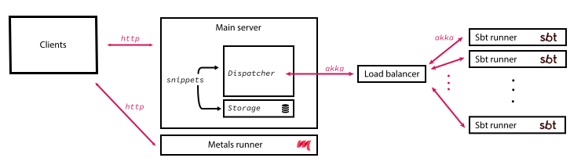
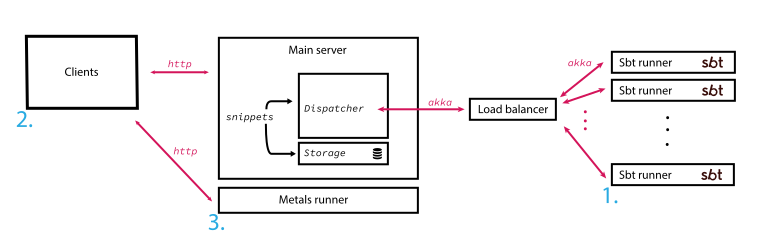
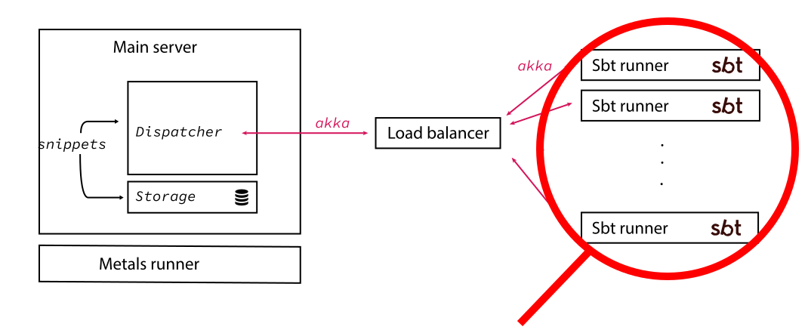

# Welcome!
# Implementing Scala-CLI on Scastie
## Semester bachelor project at the Scala-Center

---

# How Scastie works?

<!-- Quick overview -->

--- 

# Steps

1. Create the Scala-CLI runner
2. Create UI components for Scala-CLI
3. Make directives work with Metals

---

# 1. The Scala-CLI Runner

---

## 1. A first − stupid − idea

* The issue?
→ Compilation errors are not machine readable. Hard to forward them nicely to the users

---

## Previous implementation with SBT behavior

:warning: The runner was **parsing the process' output**!

---

## 2. Let's do it properly

How do IDEs connect to compilers? The [Build Server Protocol](https://build-server-protocol.github.io/) comes to the rescue!

---

## 2. Let's do it properly with the build server protocol   

The build server protocol : 
