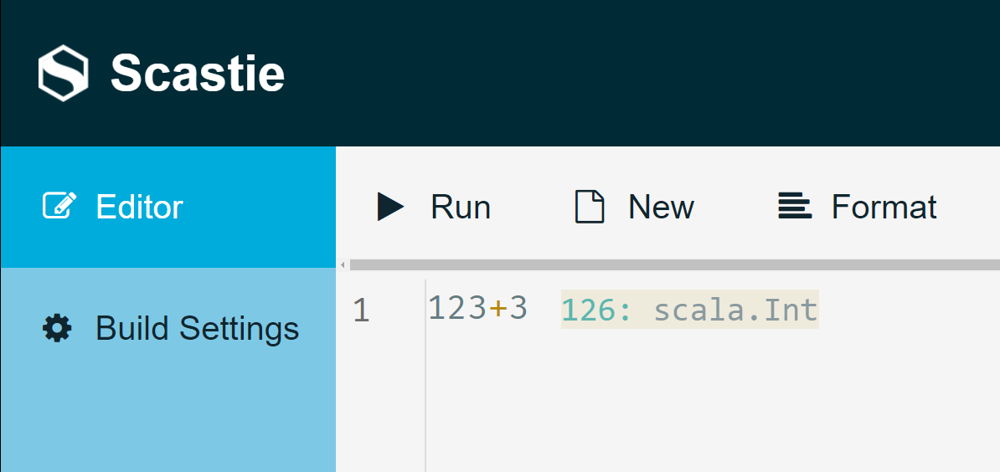

# Welcome!
# Implementing Scala-CLI on Scastie
## Semester bachelor project at the Scala-Center

> Please try to avoid printing this document, use the online version for links and saving trees 🌳

---

<!-- _footer : Reference: report chapter 0.0 -->
# Before anything


* I hope you are having a great day.
* Take a bottle of water, it is really hot outside :hot_face:
* This oral presentation is a condensed and oral version of my report. Some details had to be removed but for completeness, you may refer to it.
  * Every slide that has a link to the report will be mentionned in the footer.

---

# What is [Scastie](https://scastie.scala-lang.org/)?

* A demo is worth a thousand words…

---

<!-- _footer: Reference: report chapter 1.2, 1.3 -->

# How Scastie works?


<!-- Quick overview -->

--- 

# Steps

1. Create the Scala-CLI runner
2. Create UI components for Scala-CLI
3. Make directives work with Metals


---

# 1. The Scala-CLI Runner


---

<!-- _footer: Reference: Report, 2.1 -->

## 1. A first <!-- joke --> ~~stupid~~ <!-- joke end --> idea 


* The issue?
→ Compilation errors are not machine readable. Hard to handle them and forward them nicely to the users.
→ Might create some obvious issues with my colleague…

---

## Previous implementation with SBT

:warning: The runner was **parsing the process' output**! Crazy people… I'm lazy.

:+1: Lazy is a good point despite what you might think, I like to write the fewest lines of code possible so it is easy to maintain :wink:

---

## 2. Let's start from scratch and do it properly

__Idea__: How do IDEs talk to compilers?

__Solution__: A protocol?

<!-- joke -->

---

# Is there something like this already? Someone must have thought of it.

Open-source software people are crazy.

<!-- joke end -->


---

The [Build Server Protocol](https://build-server-protocol.github.io/) comes to the rescue!

> The Build Server Protocol (BSP) provides endpoints for IDEs and build tools to communicate about directory layouts, external dependencies, compile, test and more.

Or to be short:

> Talk to compilers.

---

##  Let's do it properly with the Build Server Protocol  

It's nice!

---

# BSP

A protocol to talk to compilers. Inspired by the Language Server Protocol.

* Did someone also made a library for this? Of course!

<!-- joke -->
---

# Why BSP?

* Because Jędrzej (❤️) told me so…

---

# Please stop joking, it's a serious presentation.

<!-- joke end -->

---

# Why BSP?

* Trigger compilations (`buildTarget/compile`)
* Trigger runs (`buildTarget/run`)
* Get diagnostics such as compilation errors and warnings (notifications on `build/publishDiagnotics`)

→ Looks perfect!

---

# What's more? Extensions! 💕

* If the compiler has specific capabilities, some endpoints are defined. In the case of Scala and this project, the endpoint `buildTarget/scalaMainClasses` was useful.
* Why? Wait for a bit… Everything in its time!

---

Side note: Futures are great in Scala.

---

# How does the actual code looks like? 1/2

```scala
    for (
      r <- reloadWorkspace;
      buildTarget <- getBuildTargetId;

      // Compile
      compilationResult <- withShortCircuit(buildTarget, target => compile(id, target));

      // Get main class
      // Note: it is combined to compilationResult so if compilationResult fails,
      // then we do not continue
      mainClass <- withShortCircuit[(BuildTargetIdentifier, CompileResult), ScalaMainClass](
        combineEither(buildTarget, compilationResult),
        {
          case ((tId: BuildTargetIdentifier, _)) => getMainClass(tId)
        }
      );

      // …
```

---

# How does the actual code looks like? 2/2

```scala
      // Get JvmRunEnv
      jvmRunEnv <- withShortCircuit[(BuildTargetIdentifier, ScalaMainClass), JvmEnvironmentItem](
        combineEither(buildTarget, mainClass),
        {
          case ((tId: BuildTargetIdentifier, _)) => getJvmRunEnvironment(tId)
        }
      )
```

**Why?!** Everything in its time… 😉 Trust me.

---

# Instrumentation? With which magic we end-up with this?



---

# Instrumentation walk-through 1/3

Suppose that we execute 
```scala
1
```

We are minimalist

---

# Instrumentation walk-through 2/3

🧙 Some magic… Scala Meta-programming's documentation was not for me…

:warning: The shown result will be a beautified one. Refer to the report for details.

---

# Instrumentation walk-through 3/3

Result:

```scala
import com.olegych.scastie.api.runtime._

object Main {
    def suppressUnusedWarnsScastie = Html
    val playground = Playground
    def main(args: Array[String]): Unit = {
        playground.main(Array())
        scala.Predef.println(<instrumentations result>)
    }
}

object Playground extends ScastieApp {
    private val instrumentationMap$ = Map[Position, Render].empty
    def instrumentations$ = instrumentationMap$.toList.map {
        case (pos, r) => Instrumentation(pos, r)
    }

    locally {
        val $t = 1
        instrumentationMap$(Position(0, 1)) = render($t)
        $t
    }
}
```

---

# Remarks on the instrumentation

* We have new objects
* Comments will end-up in the `object Playground`.
  - if comments ends up here, directives too! We have to put them at the top of the file.

---

# How to do it?

Fairly easy thanks to the Scala standard library.

```scala
    val (userDirectives, userCode) = task.inputs.code.split("\n")
      .span(line => line.startsWith("//>"))
```

:+1:

---

# Now, what is the runner doing?

Let's backtrack to all my tries, including the one where I took my laptop out in the replacement bus from Genève Cornavin to Chêne-Bourg, looking like a nerd in front of normal people.

---

# What's doing the runner?
## 1. Starting Scala-CLI in BSP

Spawns a `scala-cli bsp .` in a temporary empty folder. Scala-CLI initializes a new workspace.

---

I lied…

It spawns `scala-cli bsp . -deprecation` to enable warnings on deprecations: 🤠.

---

## 2. Inits a BSP connection to the server

`build/initialize`:

```typescript
export interface InitializeBuildParams {
  /** The rootUri of the workspace */
  rootUri: URI = "<folder>";

  /** Name of the client */
  displayName: String = "BspClient";

  /** The version of the client */
  version: String = "1.0.0";

  /** The BSP version that the client speaks */
  bspVersion: String = "2.1.0-M4";

  /** The capabilities of the client */
  capabilities: BuildClientCapabilities = BuildClientCapabilities(listOf("scala"));

  /** … */
}
```

---

Once finished,

---

# The runner is ready for run requests!

Overall idea:

1. Instrument code, and write it on disk.
2. Compile the code `buildTarget/compile`. Forward any error to the user.
3. Run the code using `buildTarget/run`. Forward any result or timeout issue.

You have seen the code before and it has way many more steps, what happened?!

---


## 1. Instrumenting the code

We have to take into consideration the directives. This is done.

Write everything to a file `main.scala`.

---

### :warning: Instrumentation needs to know the Scala version

The runner tries to find the directive `//> using scala "<version>"`. Finds the target from `<version>` and forward it to the instrumenter!

---

# BSP world is here.

---

## 2. Compile the code

Compilation was fairly easy to handle. But how does it work?

---

### How does it work?

* Client (Scala-CLI runner) sends a `buildTarget/compile` request.
* Server (Scala-CLI) will notify the progress and compilations errors in a notification `build/publishDiagnostics`.
* We need to keep track of these diagnostics.

---

But before compiling, we need to refresh the workspace (to be extra-sure) that dependencies are taken into consideration!

So the steps of compiling are:

1. `workspace/reload`
2. `workspace/buildTargets` to get the builds' target `id`.
3. `buildTarget/compile` to compile. While keeping track of the diagnostics.

---

# Compilation is working! Except something…

## Infinite compilations

With Scala's meta-programming, it is possible to make code that never compiles. Despite sending cancellation requests, the cancellation never ends for the current file (that may contain this issue).

The chosen solution is to log the problematic script, `sys.exit(-1)` and let Docker restart the container.

<!-- _footer: Reference: report 2.2.3 -->

---

# Where are we?

1. Instrumentation :white_check_mark: 
2. Compiling :white_check_mark: 
3. Running :negative_squared_cross_mark: 

---

# How to run the code?

Use `buildTarget/run` and voilà!

---

# It did work as intented! However…

Non-finishing program such as:

```scala
while(true) do println("hello to the ones reading the slides!")
```

or if you like for-comprehensions

```scala
for (_ <- Stream.from(0)) do println("hello again…")
```

We can send a cancellation request to Scala-CLI to stop the program.

---

But, it did not __work__ for a reason that is obscure and related to Scala-CLI's codebase. How to make it work then?

As I said, BSP is amazing. They have thought of everything.

---

# We are grown-ups. I have enough knowledge (:lying_face:) to run it by myself.

:warning: Scala cool kid area :sunglasses:

---


---

# Final thanks

---

# Thank you for listening and your attention
 Thanks for Julien Richard-Foy and Jędrzej Rochala for letting me work on this project
It was a freaking good atmosphere to work on such a project. I will miss those weekly meetings on Monday with Jędrzej :smiling_face_with_tear:

I hope the project suited your expectations, because it did suit mines

---

:heart: